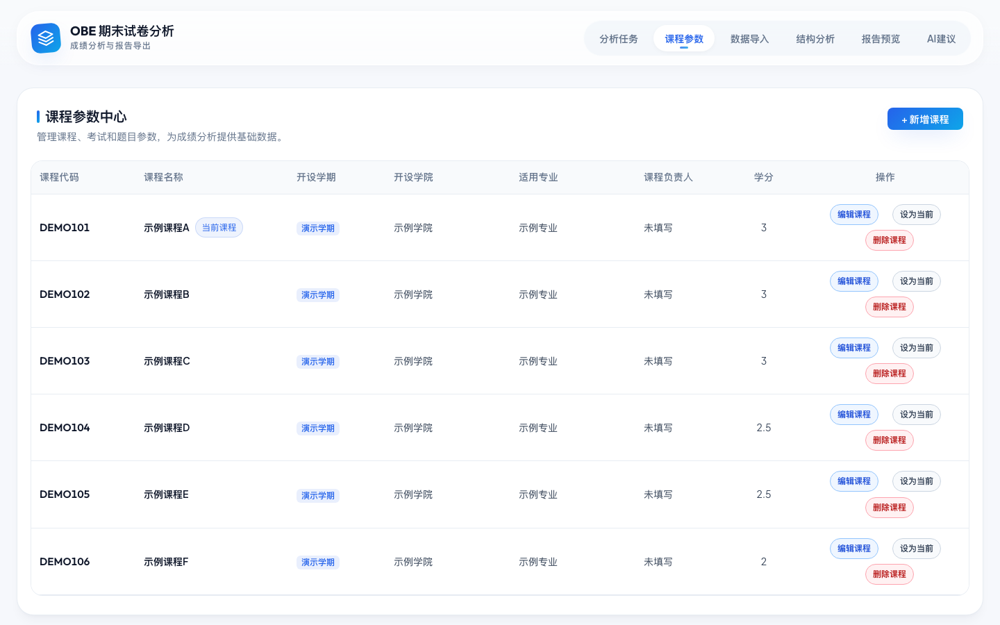

# OBE-ExamViz

[English](README.md) | [简体中文](README.zh-CN.md)

[](https://github.com/YfengJ/OBE-ExamViz/actions/workflows/ci.yml)
[](LICENSE)
[](backend/requirements.txt)
[](frontend/package.json)

OBE-ExamViz is an Outcome-Based Education (OBE) exam analysis system for college instructors. It turns a simplified score workbook into course outcome attainment analysis, AI-assisted teaching suggestions, and a Word exam-analysis report.

The project was built as a graduation project and is designed for local deployment, classroom-scale data processing, and privacy-aware report generation.

## Highlights

- **Simplified score input**: teachers only fill in the raw fields needed for analysis, not averages, attainment values, charts, or final report text.
- **Syllabus-assisted course setup**: course metadata and course objectives can be extracted from a teaching syllabus and reused by later score imports.
- **Flexible score import**: the backend supports the simplified workbook and compatible real-world score files used during development.
- **OBE analysis**: computes score distribution, question-type performance, per-question rates, course outcome attainment, and readiness checks.
- **AI-assisted suggestions**: generates report-ready teaching improvement suggestions with privacy safeguards.
- **Word report export**: exports a formal exam-analysis document from the system-calculated result snapshot.
- **Delivery friendly**: the repository excludes local databases, API keys, private score files, real syllabi, generated reports, and dependency folders.

## Screenshots

The screenshots below were captured from a temporary demo database and contain only public placeholder data such as demo courses, demo classes, and demo teachers.

| Workbench | Course Parameters |
| --- | --- |
|  |  |

| Data Import | Structure Analysis |
| --- | --- |
|  |  |

| Report Preview |
| --- |
|  |

## Workflow

1. Create or select a course.
2. Optionally create the course from a teaching syllabus.
3. Upload a score workbook.
4. Preview and confirm the imported data.
5. Run the calculation.
6. Review charts, course outcome attainment, and readiness checks.
7. Generate AI suggestions when needed.
8. Export the Word exam-analysis report.

## Tech Stack

| Layer | Technologies |
| --- | --- |
| Frontend | Vue 3, Vite, Element Plus, ECharts |
| Backend | Python 3.10+, FastAPI, SQLAlchemy, Pandas, NumPy |
| Database | SQLite by default, PostgreSQL-ready configuration |
| AI | DeepSeek API through an OpenAI-compatible client |
| Reports | openpyxl, python-docx, XLSX / DOCX generation |

## Project Structure

```text
repo/
  backend/
    app/
      api/
      ai/
      core/
      db/
      models/
      reports/
      schemas/
      services/
      utils/
      main.py
    templates/
    tests/
    requirements.txt
  frontend/
    src/
      api/
      components/
      stores/
      views/
      main.ts
    package.json
    vite.config.ts
  docs/
  sample_data/
  scripts/
  CHECKLIST.md
  README.md
  README.zh-CN.md
```

## Quick Start

Run the backend from the repository root.

```bash
python -m venv .venv
source .venv/bin/activate
pip install -r backend/requirements.txt
uvicorn backend.app.main:app --reload --host 0.0.0.0 --port 8000
```

Python 3.12 is supported. The backend requirements file selects a Python-3.12-compatible NumPy wheel automatically.

On Windows, activate the virtual environment with:

```powershell
.venv\Scripts\activate
```

Start the frontend in another terminal:

```bash
cd frontend
npm install
npm run dev
```

Open:

- Frontend: [http://localhost:5173](http://localhost:5173)
- Backend Swagger UI: [http://localhost:8000/docs](http://localhost:8000/docs)

If the backend port is not `8000`, configure `frontend/.env`:

```env
VITE_API_PROXY_TARGET=http://127.0.0.1:8001
VITE_API_TIMEOUT_MS=60000
```

## Environment Variables

Copy `.env.example` or `backend/.env.example` to `.env`, then fill in only the values needed by your local machine.

```env
DEEPSEEK_API_KEY=your_deepseek_api_key
DEEPSEEK_API_BASE=https://api.deepseek.com/v1
DEEPSEEK_MODEL=deepseek-chat
AUTO_SEED_DEMO_DATA=false
```

If no API key is configured, the core import, calculation, visualization, and report export workflow still works. AI text generation falls back to rule-based local content.

## Privacy And Repository Hygiene

Do not commit private teaching data or local runtime files.

- Do not commit `.env`, `.env.*`, API keys, tokens, or local credentials.
- Do not commit SQLite databases, generated reports, temporary exports, or release archives.
- Do not commit real score workbooks, real syllabi, student identifiers, or teacher-provided private files.
- AI requests are designed to use aggregated or anonymized analysis context instead of student names or student numbers.
- Delivery packages should be generated from the sanitized source tree and verified before sharing.

Relevant ignored locations include `data/`, `output/`, `tmp/`, local databases, dependency folders, and environment files.

## Templates And Documents

- Input template: `backend/templates/teacher_input_template.xlsx`
- Word report template: `backend/templates/teacher_report_template.docx`
- Teacher-facing deployment guide: [docs/部署与使用说明.md](docs/部署与使用说明.md)
- Contributing guide: [CONTRIBUTING.md](CONTRIBUTING.md)
- Security policy: [SECURITY.md](SECURITY.md)
- Roadmap: [ROADMAP.md](ROADMAP.md)
- Changelog: [CHANGELOG.md](CHANGELOG.md)
- Delivery checklist: [CHECKLIST.md](CHECKLIST.md)
- Chinese README: [README.zh-CN.md](README.zh-CN.md)

## Verification

Before packaging or publishing, run:

```bash
./scripts/verify_delivery.sh
```

The script checks patch whitespace, high-risk AI privacy patterns, backend tests, and the frontend production build.

To create a sanitized teacher-facing archive locally, run:

```bash
./scripts/package_release.sh
```

The package is written to `output/release/OBE-ExamViz-teacher.zip`. GitHub Actions also builds and uploads the same package as the `OBE-ExamViz-teacher` artifact.

You can also run the main checks manually:

```bash
python -m pytest backend/tests -q
cd frontend && npm run build
```

## Notes For Public Maintenance

- Keep public documentation generic and avoid naming real classes, teachers, students, or course files.
- Keep generated delivery archives outside the tracked repository.
- If GitHub publishing is needed, inspect `git status` and `git diff --stat` first, then commit only source code, templates, sample data, and documentation that are safe to publish.
