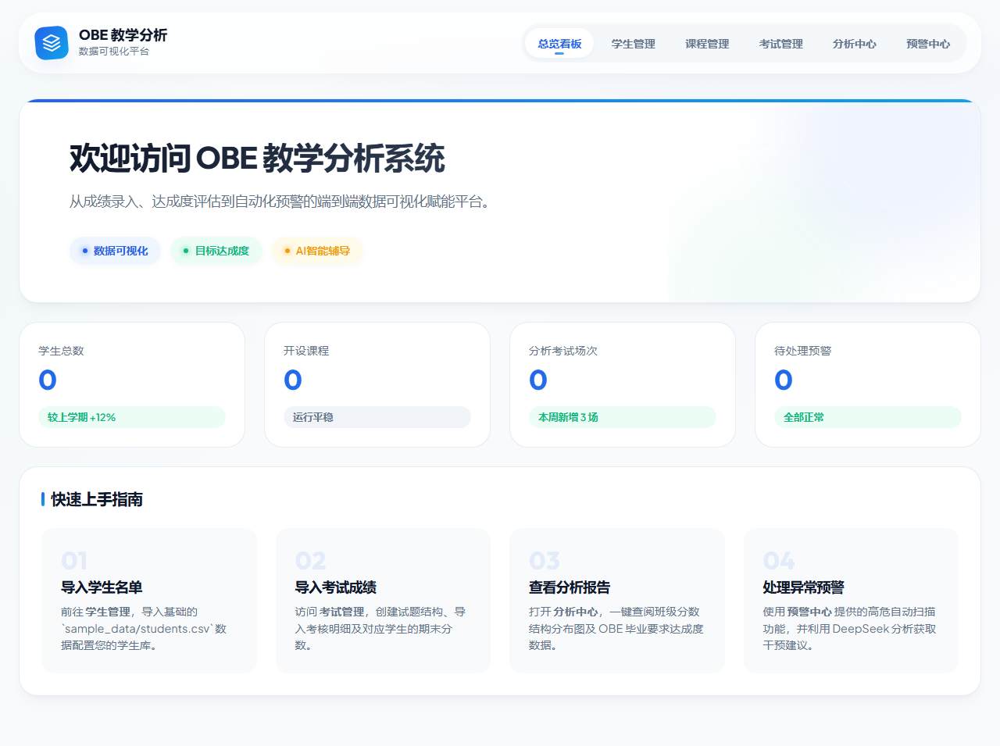
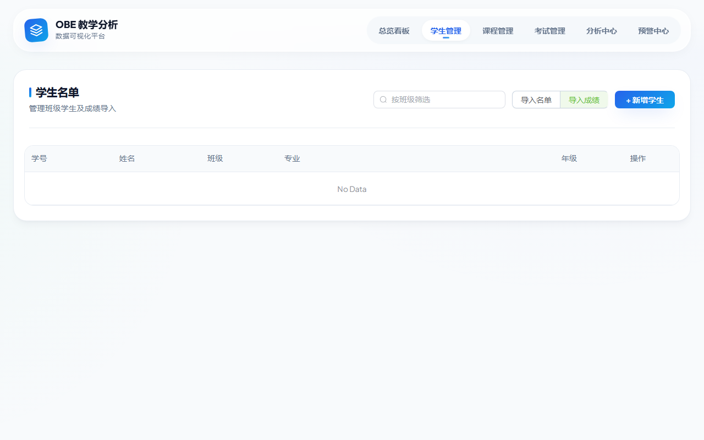
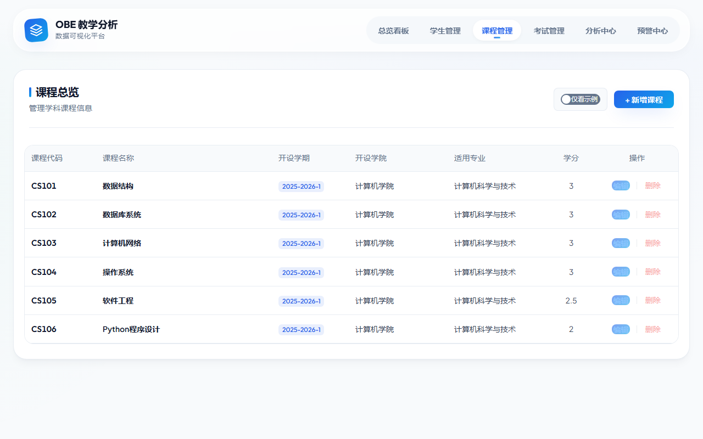
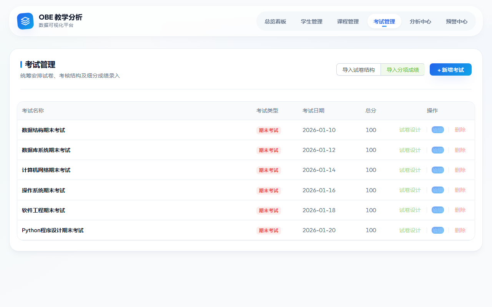
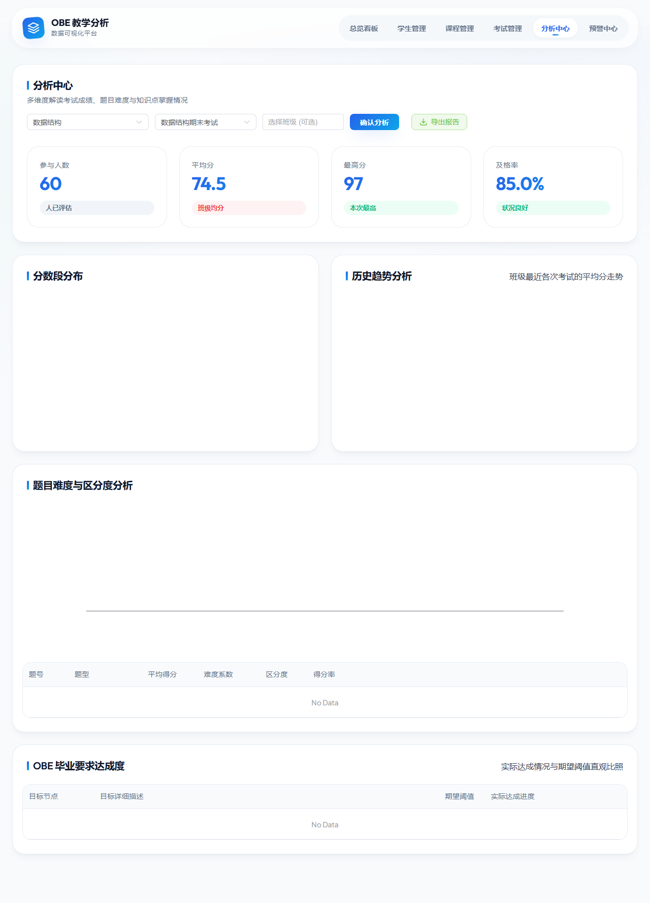
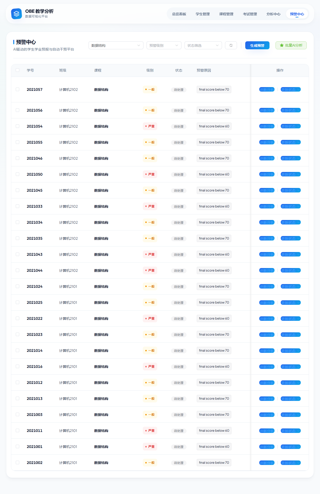

# OBE-ExamViz — 基于 OBE 理念的期末试卷分析与成绩可视化系统

一个面向高校教师和教务管理人员的全栈 Web 应用，围绕成果导向教育（OBE）理念，提供从成绩录入、多维统计分析、课程目标达成度评估到学业预警干预的一体化解决方案。

---

## 功能亮点

- 学生 / 课程 / 考试 / 题目的结构化管理，支持 CSV / Excel 批量导入
- 成绩统计：人数、均分、最高分、最低分、及格率、五段分布直方图
- 题目分析：逐题难度系数、区分度、得分率
- OBE 达成度：按课程目标（CO）自动聚合计算，与设定阈值可视化对比
- 学业预警：基于规则自动识别学习困难学生，集成 DeepSeek AI 生成个性化诊断报告
- 一键导出全中文表头的 Excel 成绩分析报表

## 技术栈

| 层次 | 技术 |
|------|------|
| 前端 | Vue 3 + Vite + Element Plus + ECharts |
| 后端 | Python 3.10+ / FastAPI / SQLAlchemy / Pandas / NumPy |
| 数据库 | SQLite（开箱即用，可平滑切换 PostgreSQL / MySQL） |
| AI 能力 | DeepSeek API（OpenAI 兼容接口） |

## 界面预览

### 首页仪表盘


### 学生管理


### 课程管理


### 考试与试题管理


### 成绩分析中心


### 学业预警中心


## 目录结构

```
├── backend/          # FastAPI 后端服务
│   ├── app/
│   │   ├── api/      # 路由与接口定义
│   │   ├── models/   # SQLAlchemy 数据模型
│   │   ├── schemas/  # Pydantic 请求/响应模型
│   │   ├── services/ # 业务逻辑层（分析、预警、导入）
│   │   ├── reports/  # Excel 报表生成
│   │   └── ai/       # DeepSeek AI 集成
│   └── requirements.txt
├── frontend/         # Vue 3 前端应用
│   ├── src/
│   │   ├── views/    # 页面视图组件
│   │   ├── components/ # 图表等通用组件
│   │   ├── api/      # 接口封装
│   │   └── styles/   # 全局样式体系
│   └── package.json
├── sample_data/      # 演示数据（2 个班级，60 名学生）
├── docs/             # 项目文档（需求、架构、数据库、API 等）
├── 前端界面截图/      # 系统各页面截图
└── README.md
```

## 快速开始

### 1. 克隆仓库

```bash
git clone https://github.com/你的用户名/OBE-ExamViz.git
cd OBE-ExamViz
```

### 2. 启动后端

```bash
python -m venv .venv

# Windows
.venv\Scripts\activate
# macOS / Linux
source .venv/bin/activate

pip install -r backend/requirements.txt

# 在项目根目录下运行
uvicorn backend.app.main:app --reload --host 0.0.0.0 --port 8000
```

> 注意：必须在项目根目录（包含 backend/ 文件夹的那一层）运行 uvicorn，否则会出现 ModuleNotFoundError。

### 3. 启动前端（新终端窗口）

```bash
cd frontend
npm install
npm run dev
```

启动完成后：
- 前端界面：http://localhost:5173
- 后端 API 文档：http://localhost:8000/docs

### 4. 体验流程

1. 系统会自动加载 `sample_data/` 中的演示数据
2. 在"分析中心"选择课程和考试，查看统计图表与 OBE 达成度
3. 在"预警中心"生成学业预警并触发 AI 诊断报告
4. 点击"导出报告"下载中文表头的 Excel 分析报表

## 演示数据说明

| 文件 | 内容 |
|------|------|
| students.csv | 60 名学生基本信息（学号、班级、专业） |
| courses.csv | 课程信息 |
| exams.csv | 考试安排 |
| exam_scores.csv | 期末总分 |
| questions.csv | 试卷题目结构（题型、分值、知识点、CO 映射） |

## 环境变量配置

复制 `.env.example` 为 `.env` 并填写：

```
DEEPSEEK_API_KEY=你的DeepSeek API密钥
```

不配置 API Key 不影响核心分析功能，仅 AI 诊断报告功能不可用。

## 项目文档

完整的技术文档位于 `docs/` 目录：

- 01 调研背景
- 02 需求分析
- 03 系统架构设计
- 04 数据库设计
- 05 分析指标与算法
- 06 API 接口文档
- 07 测试方案
- 08 部署指南
- 10 用户使用手册
- 11 总结与展望

## License

MIT
